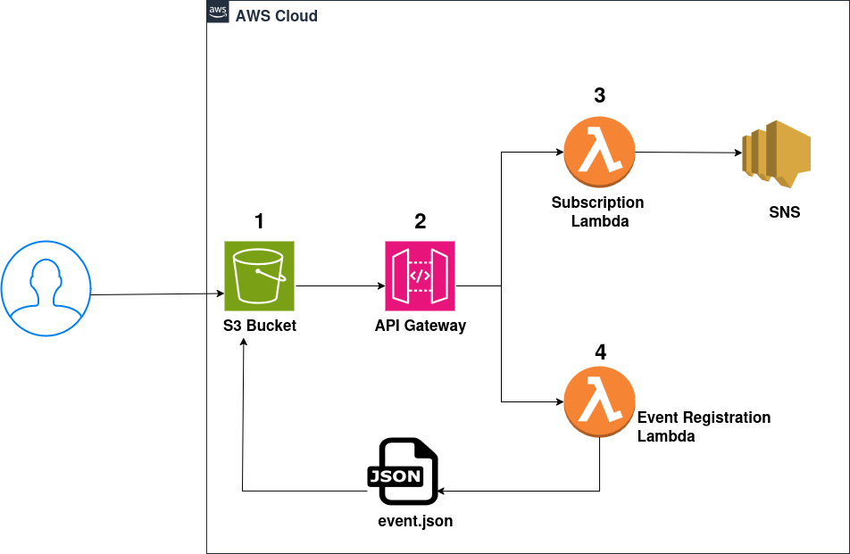
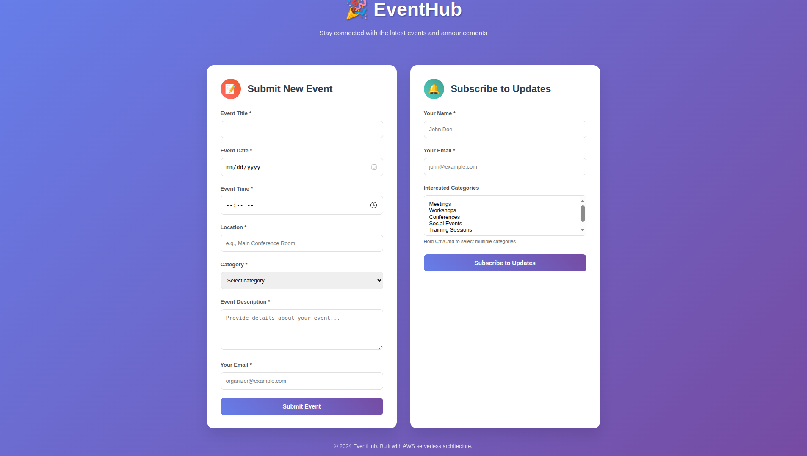

# Event Announcement Website

## Architecture Overview

The following diagram illustrates the architecture of the Event Announcement Website deployed on AWS:

### Components

1. **S3 Bucket**: Hosts the static website files (HTML, CSS, JS) and stores event data (e.g., `event.json`).
2. **API Gateway**: Serves as the entry point for client requests, routing them to the appropriate Lambda functions.
3. **Subscription Lambda**: Handles user subscriptions and publishes notifications to Amazon SNS.
4. **Event Registration Lambda**: Processes event registration data and updates the S3 bucket with new event information.
5. **SNS (Simple Notification Service)**: Sends notifications to subscribers based on events.

### Flow
- Users interact with the static website hosted on S3.
- Form submissions are sent to the API Gateway.
- API Gateway triggers the appropriate Lambda function (Subscription or Event Registration).
- Event data is stored in S3, and notifications are sent via SNS as needed.

---

## Website Screenshot

Below is a screenshot of the EventHub website user interface:

